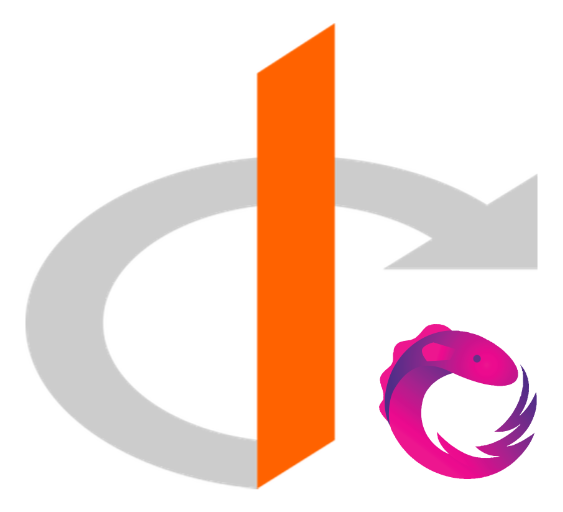

<h1 align="center">
  
  <div style="color: #232848; font-weight: 700;">OIDC-CLIENT-RX</div>
  <div align="center">
    
    
  </div>
</h1>

<p align="center">ReactiveX enhanced OIDC and OAuth2 protocol support for browser-based JavaScript applications.</p>

## Quick Start

@TODO Add More Details

### Install

```sh
pnpm add oidc-client-rx @outposts/injection-js @abraham/reflection
# npm install oidc-client-rx @outposts/injection-js @abraham/reflection
# yarn add oidc-client-rx @outposts/injection-js @abraham/reflection
```

### Basic Usage

```typescript
import '@abraham/reflection'; // or 'reflect-metadata' | 'core-js/es7/reflect'
import { type Injector, ReflectiveInjector } from '@outposts/injection-js';
import { LogLevel, OidcSecurityService, provideAuth, withDefaultFeatures } from 'oidc-client-rx';

const injector = ReflectiveInjector.resolveAndCreate(
  provideAuth(
    {
      config: {
        authority: '<your-authority>',
        redirectUrl: `${window.location.origin}/auth/callback`,
        postLogoutRedirectUri: window.location.origin,
        clientId: '<your-client-id>',
        scope: 'openid profile email offline_access',
        responseType: 'code',
        silentRenew: true,
        useRefreshToken: true,
        logLevel: LogLevel.Debug,
        ...
      },
    },
    withDefaultFeatures()
  )
) as Injector;

const oidcSecurityService = injector.get(OidcSecurityService);

oidcSecurityService.checkAuth().subscribe((result) => {
  console.debug('checkAuth result: ', result);
});

const isAuthenticated$ = oidcSecurityService.isAuthenticated$;
```

### More Examples

- [React + TanStack Router](https://github.com/lonelyhentxi/oidc-client-rx/tree/main/examples/react-tanstack-router)

## License

[MIT](https://choosealicense.com/licenses/mit/)
